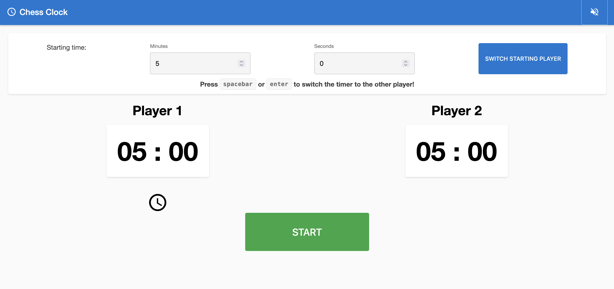

# Chess Clock

Years ago, I wanted to make a simple app to test my skills learning web development. So I built a chess clock since I was learning chess at the time. It's a simple two-player timer that switches between players when you press a button.

## 

## How to use it

1. Set a time that each player should be allotted (in minutes and seconds)
2. Press **Start** to begin the game
3. When a player completes their move, press **spacebar** or **enter** on the keyboard to switch to the other player's timer. (On mobile, tap the **Switch** button.)
4. The game ends when one player's time runs out.